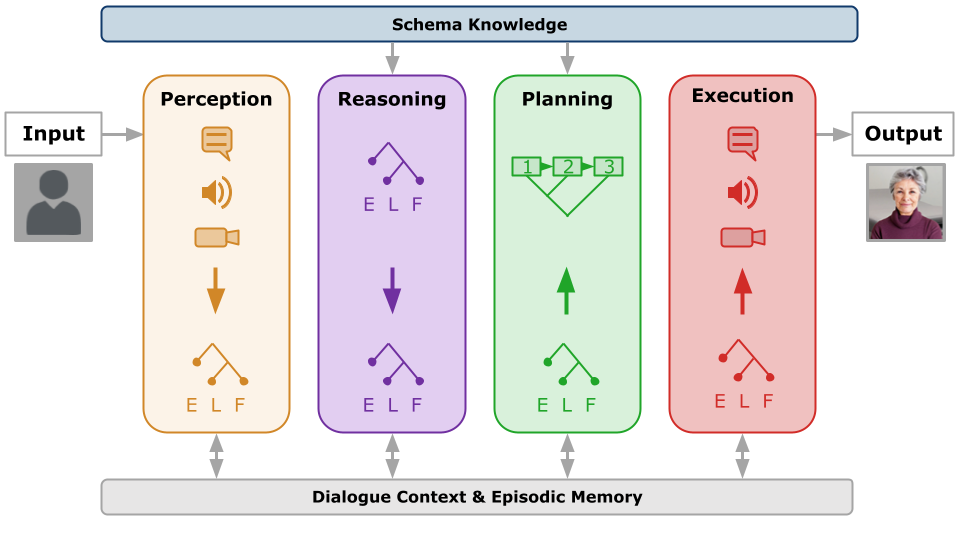

# Eta Dialogue Manager

This is the official Python implementation of the Eta Dialogue Manager, a general-purpose and extensible framework for creating intelligent conversational agents from **dialogue schemas** that represent expected dialogue events within a particular domain. The dialogue manager interleaves four parallel processes, each of which operate on a shared dialogue state:
* perception
* reasoning
* planning
* execution

The specific functionality of each process can be modified through the use of modular **transducers** that perform a specific type of data mapping (e.g., mapping input utterances to semantic representations, or mapping a dialogue plan to a new expanded dialogue plan). Each type of transducer is implementation-agnostic, allowing for the substitution of many possible models for each type of mapping function -- whether symbolic rules, a neural network, a large language model API, or some combination thereof. The modified data is processed using a set of buffers (priority queues) in order to ensure consistency between processes.

Eta is also representationally flexible, allowing for multiple levels of knowledge representation for events in schemas and memory. All of these three levels are encapsulated by the notion of an **eventuality**, which represents an abstract fact or event with an associated representation.

##### Natural Language

At the most basic level, events may be described by natural language strings, which is often sufficient for more casual or open-ended domains, and can be easily integrated with data-driven NLP techniques.

E.g., `"John went to the store ."`

##### Episodic Logic (EL)

For more complex reasoning-intensive tasks, events may be represented using formulas in [Episodic Logic](https://www.cs.rochester.edu/research/epilog/) (EL), an expressive first-order intensional logic where events (or episodes) are explicit constants, and can be *characterized* by formulas using a `**` operator.

E.g., `((|John| go.v |Store3|) ** E2) (E2 during.p Now7)`

##### Unscoped Logical Form (ULF)

Finally, as a middle-ground between these two levels of formality, events may be represented using [Unscoped Logical Form](https://cs.rochester.edu/u/gkim21/ulf/) (ULF), a variant of EL that preserves the semantic types of EL while leaving certain phenomena (operator scopes, tense, word senses, and anaphora) unresolved in order to closer mirror natural language.

E.g., `(|John| ((past go.v) (to.p-arg (the.d store.n))))`

## Quick Start

### Installing Eta

Eta requires a working installation of Python 3.8 or newer.

Install the Eta dialogue manager by cloning the repository: `git clone https://github.com/bkane2/eta-py.git`, and `cd eta-py`.

If desired, create and activate a virtual environment using `python3 -m venv env` and then `source env/bin/activate`.

Next, install the required dependencies using `pip install -r requirements.txt`.

If using an agent configuration that relies on an external API (see the below agent examples, as well as the documentation), a text file containing a valid API key should be provided in the `_keys` directory (i.e., `_keys/openai.txt` for the OpenAI API, required for agents that use GPT-based transducers, and `_keys/hf.txt` for the HuggingFace API.)

#### Troubleshooting

##### Exception: Can not find valid pkg-config name. Specify MYSQLCLIENT_CFLAGS and MYSQLCLIENT_LDFLAGS env vars manually

If you run into this error when installing the required dependencies, it is likely because you do not have a MySQL client installed, which is a dependency for mysqlclient, which in turn is a dependency of one of the packages that Eta relies on. You can try following the installation instructions on the [mysqlclient page](https://pypi.org/project/mysqlclient/).

However, there is also a way to bypass the MySQL dependency by running the following command prior to installing the rest of the dependencies:

`pip install git+https://github.com/uob-vil/pattern.git`

### Running Eta

#### Configuration

Running Eta requires both an agent configuration and a user configuration to be provided as command-line arguments. Agent configurations must be provided as Python scripts in [`eta/config/`](https://github.com/bkane2/eta-py/tree/main/eta/config) that export a `config()` function returning a configuration dict. The existing presets are discussed in [Agent Presets](#agent-presets). User configurations must be provided as JSON files in [`user_config/`](https://github.com/bkane2/eta-py/tree/main/user_config); see [`user_config/test.json`](https://github.com/bkane2/eta-py/blob/main/user_config/test.json) for an example.

#### Start Command

Eta can be started using the following command:
`python3 -m eta.core.eta --agent <agent_config> --user <user_config>`

For example,
`python3 -m eta.core.eta --agent sophie_gpt --user test`

#### IO Format

Once Eta is fully loaded (which may take several seconds), an IO directory will be created at `io/<agent>/<user_id>/`, where `<agent>` and `<user_id>` are the values of these variables in the corresponding agent and user configuration dicts (note: *not* necessarily the filenames used in the above command).

Speech input can be given to the agent by writing to `<io_dir>/in/speech.txt`. For any additional perceptual or specialist server defined in the agent config file, corresponding IO channels will be created in `<io_dir>/in/` and `<io_dir>/out/` as well. The agent's utterances will be output in `<io_dir>/turn-output.txt`, as well as the agent's affect (i.e., emotion tag) in `<io_dir>/turn-affect.txt`.

A full record of the conversation (utterances as well as the agent's interpretations etc.) will be recorded in `<io_dir>/conversation-log/`, and backed up in `logs/`.

#### Terminal Shell Script

For convenience, a script `terminal.py` is provided for interacting with Eta in the terminal. ***This script should be started in a separate process before running the command to start Eta***. Start the script using one of the following commands, depending on whether the specific Eta agent begins with a user turn or agent turn:

`python3 terminal.py <agent> <user_id>`

`python3 terminal.py <agent> <user_id> --agent_start`

Where again `<agent>` and `<user_id>` refer to the values of these variables in the corresponding config files.

For example, since the 'sophie_gpt' agent begins with an agent turn:

`python3 terminal.py sophie-gpt _test --agent_start`

## Documentation

See the **[Eta documentation page](https://bkane2.github.io/eta-py/index.html)** for the full documentation of the Eta dialogue manager and each of its sub-modules.

## Agent Presets

Several preset agents are defined in [`eta/config/`](https://github.com/bkane2/eta-py/tree/main/eta/config), with the corresponding schemas and transduction rules (if applicable) in [`agents/`](https://github.com/bkane2/eta-py/tree/main/agents).

### sophie_gpt

SOPHIE is an agent that acts as a virtual lung cancer patient in a doctor-patient conversation, intended for allowing doctors to practice delivering difficult news to patients. This is the most recent version of SOPHIE, and it uses a combination of symbolic pattern transduction rules and GPT in order to interpret the user and generate responses, as well as schemas that control the flow of dialogue depending on the user's response (e.g., whether or not they were detected as being empathetic).

This agent allows for four sub-modules; the first three are intended to target a specific skill with a short interaction before pausing for feedback, while the last is intended to mimic a more natural conversation:

1. Empathy Module
2. Explicit Module
3. Empower Module
4. Master Module

To determine which module is used, change the `SESSION_NUMBER` constant in `eta/config/sophie_gpt.py` to the corresponding number from the above list.

Required API keys:
* `_keys/openai.txt`

### sophie_offline

This is identical to 'sophie_gpt' except does not use GPT, and therefore simply echoes the utterances in the dialogue schemas instead of paraphrasing them. It is intended for offline development of the sophie_gpt agent.

### sophie_rule

This is the older version of the SOPHIE virtual standardized patient evaluated in [[2,3,4]](#references), prior to GPT integration. It is functional, albiet less fluent and will tend to ask frequent clarification questions in the case of unrecognized inputs.

### lissa_gpt

TODO: still need to test and write up.

Required API keys:
* `_keys/openai.txt`

### lissa_rule

[[8]](#references)

TODO: still need to test and write up.

### david_qa

[[5,6,7]](#references)

TODO: still need to transfer.

### david_tutoring

TODO: still need to transfer.

## References

* [1] Kane B. [Flexible Dialogue Management for Virtual Conversational Agents using Semantically Rich Event Schemas](https://docs.google.com/presentation/d/1zAyYSa5a9hl-d5jfJ88cnDqUx83SHnir/edit?usp=sharing&ouid=116681091976699790382&rtpof=true&sd=true). Second Workshop on Processing and Evaluating Event Representations (PEER2023). March 31, 2023, Rochester, USA.

* [2] Kane B.; Giugno C.; Schubert L. K.; Haut K.; Wohn C.; Hoque E. [A Flexible Schema-Guided Dialogue Management Framework: From Friendly Peer to Virtual Standardized Cancer Patient](https://arxiv.org/pdf/2207.07276.pdf). arXiv:2207.07276.

* [3] Kane B.; Giugno C.; Schubert L.; Haut K.; Wohn C.; Hoque E. Managing Emotional Dialogue for a Virtual Cancer Patient: A Schema-Guided Approach. IEEE Transactions on Affective Computing (to appear).

* [4] Haut K.; Wohn C.; Kane B.; Carroll T.; Guigno C.; Kumar V.; Epstein R.; Schubert L.; Hoque E. [Validating a virtual human and automated feedback system for training doctor-patient communication skills](https://arxiv.org/pdf/2306.15213.pdf). Affective Computing and Intelligent Interaction (ACII) (to appear). September 10-13, 2023, Boston, USA.

* [5] Platonov G.; Kane B.; Schubert L. K. [Generating Justifications in a Spatial Question-Answering Dialogue System for a Blocks World](https://aclanthology.org/2021.reinact-1.8.pdf). Reasoning and Interaction (ReInAct). October 4-6, 2021, Virtual.

* [6] Kane B.; Platonov G.; Schubert L. K. [Registering Historical Context for Question Answering in a Blocks World Dialogue System](https://link.springer.com/chapter/10.1007/978-3-030-58323-1_52). Text, Speech, and Dialogue (TSD). September 8-11, 2020, Virtual.

* [7] Platonov G.; Kane B.; Gindi A.; Schubert L. K. [A Spoken Dialogue System for Spatial Question Answering in a Physical Blocks World](https://www.aclweb.org/anthology/2020.sigdial-1.16/). Special Interest Group on Discourse and Dialogue (SIGDIAL). July 1-3, 2020, Virtual.

* [8] Razavi S. Z.; Schubert L. K.; Kane B.; Rafayet Ali M.; Van Orden K. A.; Ma T. [Dialogue Design and Management for Multi-Session Casual Conversation with Older Adults](https://www.cs.rochester.edu/~schubert/papers/razavi-etc-dialogue-design...older-adults19.pdf). Workshop on User-Aware Conversational Agents (User2Agent), at the 24th Int. Conf. on Intelligent User Interfaces (ACM IUI 2019). March 17-20, 2019, Los Angeles, USA.